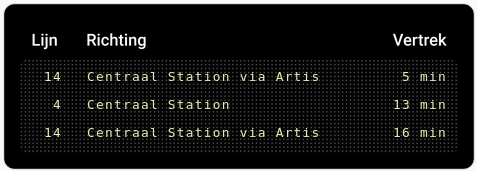
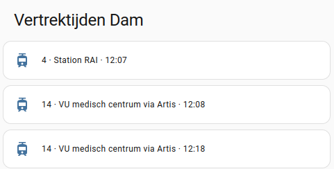
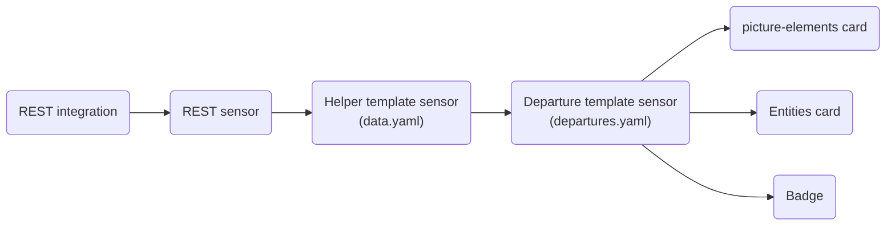
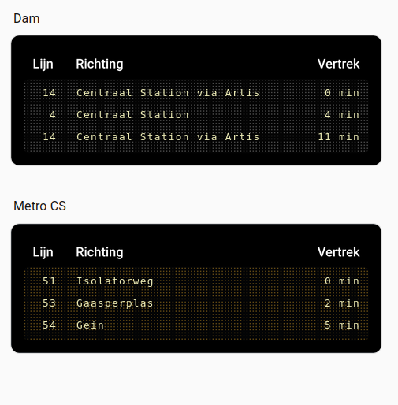
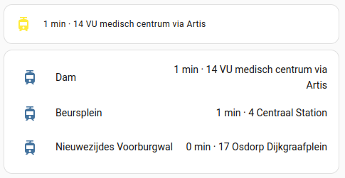
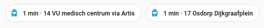

# Home Assistant OVAPI tools for Dutch GTFS data

This project provides a collection of **YAML configurations** that make it possible to use **ovapi.nl** data in Home Assistant without custom components.  
The resulting sensors can be displayed as pre-formatted entities, or their attributes can be used for fully custom presentations, such as the included **DRIS-style departure board** example.

  


Although primarily designed for OVAPI, this setup may also work with other APIs that expose **GTFS-compatible data**.

---

## Data flow



The REST integration queries the OVAPI **Timing Point Code (TPC)** endpoint and creates a REST sensor for each TPC.  
This raw data is then processed by one or more **helper sensors**. After filtering and sorting, the final **OVAPI departure sensor** exposes:

- a formatted `state` describing the next departure (bus / tram / ferry / metro)
- attributes containing details for the next three departures

These sensors can be used in cards, badges, or automations.

---

## Installation

### Prerequisites

- The **REST integration** must be enabled
- Access to the Home Assistant configuration files is required


### Blueprints

[](https://my.home-assistant.io/redirect/blueprint_import/?blueprint_url=https%3A%2F%2Fgithub.com%2FCapitalT%2FHA-OVAPI-tools%2Fblob%2Fmain%2Fblueprints%2Ftemplates%2Fdata.yaml)

[](https://my.home-assistant.io/redirect/blueprint_import/?blueprint_url=https%3A%2F%2Fgithub.com%2FCapitalT%2FHA-OVAPI-tools%2Fblob%2Fmain%2Fblueprints%2Ftemplates%2Fdepartures.yaml)

Either import the above blueprint templates directly or put the file `data.yaml` and `departures.yaml` in ```homeassistant/blueprints/ovapi``` 


### Package configuration

Edit the file `ovapi.yaml` in the `packages` directory and save it under a suitable name.  
You may also place the configurations directly in `configuration.yaml` if preferred.


---

## Setting up a departure sensor

This is the **only place where you need to adapt data values**.

The package contains a REST sensor definition and example *Helper sensors* and *Departure sensors*.  
In the example the REST feed requests data for three Timing Point Codes (TPCs), but you can use one or many.  
Keep in mind that Home Assistant does not handle very large attribute payloads well.


TPCs can be found via:  
https://william-sy.github.io/ovapi-tpc-finder/site/
https://ovzoeker.nl/
https://halteviewer.ov-data.nl/

A single bus stop usually has *two TPCs*, one for each side of the road.


```yaml
rest:
  - resource: "http://v0.ovapi.nl/tpc/30005031,30005032,30005065/departures"

```

Create a feed sensor for each tpc. This is your *ovapi feed sensor*. It contains the raw feed data. The `value_template` is not important, the data will use for now will be stored in the `Passes` attribute.

```yaml
    scan_interval: 60
    sensor:
      - name: "OVAPI Feed 30005031"
        unique_id: ovapi_feed_30005031
        json_attributes_path: $['30005031']
        json_attributes:
            - Stop
            - GeneralMessages
            - Passes
        value_template: >-
            {{ value_json['30005031'].Stop.TimingPointName }}

```

Next create a *Helper sensor* that will sort and filter the data. This *helper sensor* will use the `data.yaml` blueprint. This is where you decide what to display.
A helper can use multiple `source_sensor`s, for instance if you want to make a table for both sides of a busstop or multiple quays of a busstation.

The `lijnen` attribute is optional and can be fully ommitted. I you want to filter on a line number (string). Make it a list, also if it is a signle line you want to filter on! If you use filter, don't forget that nightbusses use a different line number.


```yaml
template:
  - use_blueprint:
      path: ovapi/data.yaml
      input:
        source_sensor: 
          - 'sensor.ovapi_feed_30005031'
        lijnen:
          - "14"
          - "4"
    name: "OVAPI helper sensor 30005031"
    unique_id: ovapi_data_30005031
```

Repeat this step for as many *helper sensors* you want. This way you can make sensors per stop, per line or even per bus station.

`source_sensor` should contain the entity_id of the OVAPI feed sensor above. If you changed the name and unique id of the feed sensor correctly in the first step, changing the tpcs should have been enough. If the sensor is not working, check the entity id of the rest sensor.

Also predefined with blueprint templates are the final information sensors. Here the name is less important and may be more descriptive. The Source sensor of the _departure sensor_  is the *OVAPI helper sensor*. Unless something strange happened the entity id of the data sensor is the slug of its name. If no data comes through, check that the entity id of the feed and helper sensors and make sure all sensors have a unique unique_id.^["The entity_id is not the same as the unique_id, they are unrelated."]

```yaml
  - use_blueprint:
      path: ovapi/vertrek.yaml
      input:
        source_sensor: 'sensor.ovapi_helper_sensor_30005031'
    name: "OVAPI vertrek Damrak"
    unique_id: ovapi_vertrek_30005031

```

You should now have three sensors per tpc. A feed, a helper and a departure sensor in [your helpers](https://my.home-assistant.io/redirect/helpers/).


### Cards

The `departure` sensor contains a formatted value showing the time to the next bus/ferry/metro/tram and attributes for the next three upcoming rides. Not that not all cards will allow you to display the attributes but with the sensor the possibilities are endless.

In the repo you find an example lovelace card of a [DRIS sign](https://www.spie-nl.com/oplossing/dynamische-reizigers-informatie-systemen). The yaml from this card you can copy-paste to a custom card. It will automatically fetch the background image from github but if you want to host the image locally you can upload the png image also via the UI and it will be locally stored.

To make adjustments easier, the lovelace card in the repo makes extensive use of YAML-anchors. The anchors are converted to plain YAML and removed when you save the card with the Home Assistant code editor. After reopening the code editor you may remove the tags used for anchors from the top of you yaml file to enable the use of the UI editor again.



Alternatively you could use a vertical-stack card with hidden entity names and just the attributes


```yaml

type: vertical-stack
title: Vertrektijden Dam
cards:
  - type: tile
    entity: sensor.ovapi_vertrek_dam
    name: " "
    state_content:
      - lijn_1
      - bestemming_1
      - vertrektijd_1
    vertical: false
    features_position: bottom
  - type: tile
    entity: sensor.ovapi_vertrek_dam
    name: " "
    state_content:
      - lijn_2
      - bestemming_2
      - vertrektijd_2
    vertical: false
    features_position: bottom
  - type: tile
    entity: sensor.ovapi_vertrek_dam
    name: " "
    state_content:
      - lijn_3
      - bestemming_3
      - vertrektijd_3
    vertical: false
    features_position: bottom

```

Or simply use the values of one or more sensors in a entities card:



Or even more simple, make a badge out of the `vertrek` sensor:



```yaml

type: entity
show_name: false
show_state: true
show_icon: true
entity: sensor.ovapi_vertrek_dam

```
  
## Bugs and limitations  
  
- The attributes are made such that they mimmic a DRIS sign.
